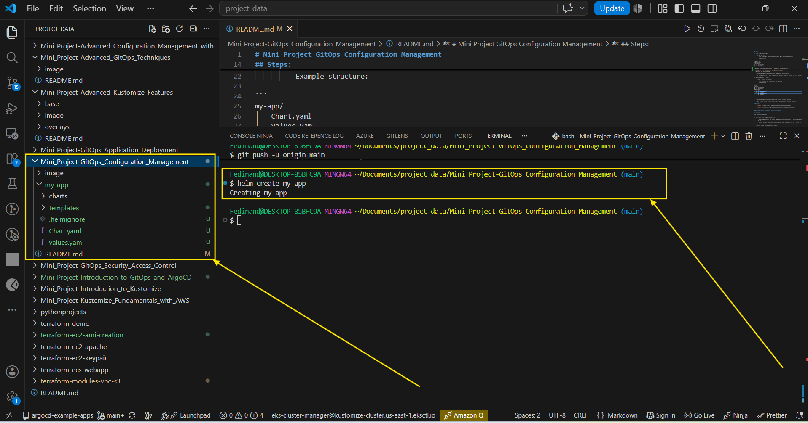
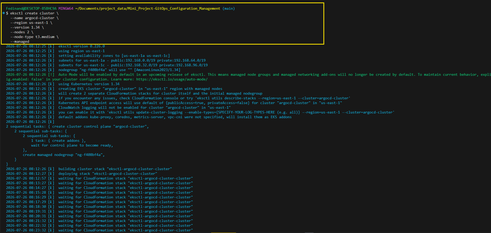
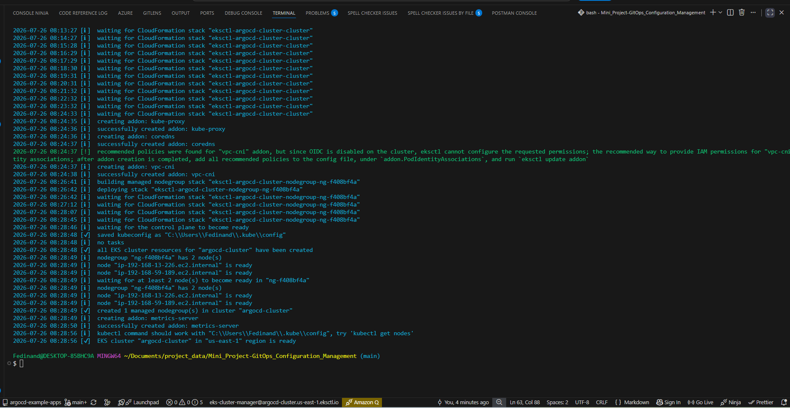
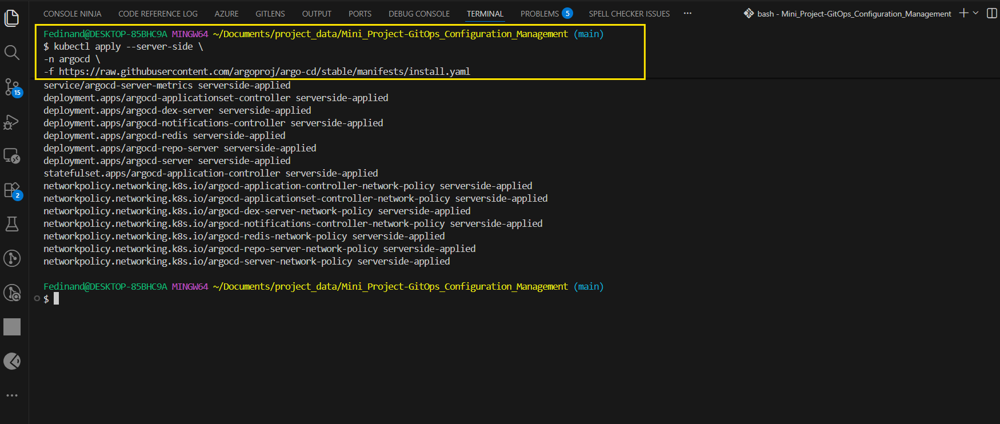
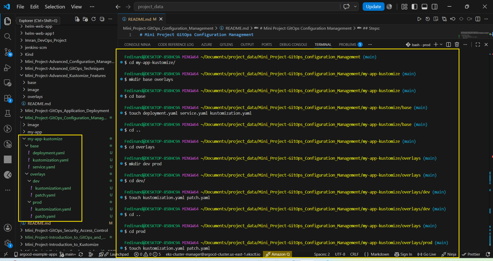

# Mini Project GitOps Configuration Management

## Module 3: Advanced Configuration Management in ArgoCD.

### Introduction

This module provides an in-depth look at advanced configuration management in ArgoCD, utilizing tools like Helm and Kustomize, and delving into secrets management and customization of resource management and sync policies.


## Lesson 3.1: Managing Configurations with Helm and Kustomize in ArgoCD.

### Objective: Learn how to manage application configurations using Helm and Kustomize in ArgoCD.

## Steps:

1.  Integrating Helm with ArgoCD:

    - Set up a Helm Chart:

        - Create a simple Helm chart or use an existing one. Place it in your Git repository.

        - Example structure:

```
my-app/
├── Chart.yaml
├── values.yaml
├── templates/
│   ├── deployment.yaml
│   ├── service.yaml
│   └── ingress.yaml
```

- The Image below is the created structure of helm chart in my working directory.



  - Deploy the Helm Chart via ArgoCD:

    - Create an ArgoCD application that points to the Helm chart in your repository.

    - Use the ArgoCD CLI or UI to set up the application, specifying the path to the chart and desired release values.

Before proceeding to these task above, I have to activate the **prerequisite** below;

  - An EKS cluster should be running
  - Kubectl have to be connected to the cluster
  - ArgoCD installed
  - Helm chart pushed to GitHub
  - AWS cli need to be configured.

Creating eks cluster for argocd deployment. below captured the step process.

```
eksctl create cluster \
  --name kustomize-cluster \
  --region us-east-1 \
  --version 1.34 \
  --nodes 2 \
  --node-type t3.medium \
  --managed
```






Now, I need to install ArgoCD in my `EKS-cluster`.

I want to show more command for argocd installation and the reasons for using each(for learning purpose).

```
kubectl apply -n argocd \
-f https://raw.githubusercontent.com/argoproj/argo-cd/stable/manifests/core-install.yaml
```


Comparison

Feature	                                  install.yaml	                                  core-install.yaml
Web UI	                                      ✅	                                          Limited/local only
API Server	                                  ✅	                                                ❌
Dex Authentication	                          ✅	                                                ❌
Notifications	                                ✅	                                                ❌
GitOps Sync Engine	                          ✅	                                                ✅
Application Controller	                      ✅	                                                ✅
Repo Server	                                  ✅	                                                ✅
Redis	                                        ✅	                                                ✅
Beginner Friendly	⭐⭐⭐⭐⭐	⭐⭐


```
kubectl apply --server-side \
-n argocd \
-f https://raw.githubusercontent.com/argoproj/argo-cd/stable/manifests/install.yaml 
```

This installs the complete Argo CD platform.

It includes:

Component	                                 Purpose	                                    Installed?
Argo CD API Server	                       Handles CLI and UI requests	                  ✅
Web UI	                                   Browser interface	                            ✅
Repository Server	                         Clones Git repositories	                      ✅
Application Controller	                   Synchronizes applications	                    ✅
Redis	                                     Caching	                                      ✅
Dex	                                       Authentication (SSO/OIDC)	                    ✅
Notifications Controller	                 Notifications	                                ✅
ApplicationSet Controller	                 Manages ApplicationSets	                      ✅

This is the version used in most tutorials and is recommended for learning and general use.




```
kubectl apply -n argocd \
-f https://raw.githubusercontent.com/argoproj/argo-cd/stable/manifests/install.yaml
```

Below is the reasons for selecting any command for argoCD deployment.

  The difference is how Kubernetes processes the manifest, not what gets installed.

  Without "--server-side"

  Your local kubectl computes the changes and stores a large last-applied-configuration annotation on resources.

  With "--server-side"
  The Kubernetes API server computes and manages the changes instead.
  This is important because some Argo CD resources (especially CRDs like ApplicationSet) are so large that they can exceed Kubernetes' annotation size limit when using "client-side" apply. Server-side apply avoids that limitation. That's why the current Argo CD documentation recommends using --server-side (and often --force-conflicts) for installation.


2.  Utilizing Kustomize in ArgoCD:

     - Prepare a Kustomize Configuration:

        - Create a Kustomize base and overlays in your repository.

        - Example structure:

my-app/
├── base/
│   ├── kustomization.yaml
│   ├── deployment.yaml
│   ├── service.yaml
└── overlays/
    ├── dev/
    │   ├── kustomization.yaml
    │   └── patch.yaml
    └── prod/
        ├── kustomization.yaml
        └── patch.yaml
```



- Deploy Using Kustomize:

    - Define an ArgoCD application that references the Kustomize overlay as the source.

    - Apply different overlays for different environments like development, staging, or production.


**Resources:**

   - [ArgoCD and Helm](https://argo-cd.readthedocs.io/en/stable/operator-manual/helm/).

   - [ArgoCD and Kustomize](https://argo-cd.readthedocs.io/en/stable/operator-manual/kustomize/)


### Lesson 3.2: Secrets Management and Best Practices in ArgoCD.

## Objective

Develop a comprehensive understanding of managing secrets securely in Kubernetes and ArgoCD, emphasizing the integration with external secret managers.


1. Understanding Secret Management in Kubernetes:

    - Kubernetes Secrets Overview:
        - Secrets in Kubernetes are used to store and handle sensitive information such as passwords, OAuth tokens, and SSH keys.

        - Learn how Kubernetes stores secrets, how to create and manage them, and how they can be injected into Pods.

- Creating and Using Kubernetes Secrets:

    - Practice creating a secret manually via `kubectl`:

```
kubectl create secret generic my-secret --from-literal=password=mypassword
```

- Learn how to reference these secrets in Pod configurations.

- Understand the limitations and security considerations, such as base64 encoding, not encryption.

### Using External Secret Managers:

- Why External Secret Managers?:

    - Kubernetes secrets are by default only base64 encoded, which is not sufficient for sensitive data.

    - External secret managers provide enhanced security features like encryption, access policies, and secret rotation.


- Integrating with HashiCorp Vault:

    - Set up a Vault server or use a managed service.

    - Store a secret in Vault and configure Vault Policies.

    - Use a tool like `argocd-vault-plugin` to integrate Vault with ArgoCD.

    - Configure ArgoCD to replace placeholders in your manifests with secrets from Vault.

- Integrating with AWS Secret Manager:

    - Store a secret in AWS Secrets Manager.

    - Use IAM roles and policies to control access to the secrets.

    - Integrate with ArgoCD using an appropriate Kubernetes operator or custom tooling to fetch secrets from AWS Secrets Manager.

### Additional Best Practices

   - **Secret Rotation:** Regularly rotate secrets and understand how this can be automated with external secret managers.

   - **Least Privilege Access:** Ensure that applications and users have only the minimum necessary permissions to access secrets.

   - **Audit Trails:** Use features provided by external secret managers to keep an audit trail of secret access and changes.

- Resources

    - Kubernetes Secrets Documentation: [Kubernetes Secrets](https://kubernetes.io/docs/concepts/configuration/secret/)

    - ArgoCD Secret Management: [Integrating External Secret Managers](https://argo-cd.readthedocs.io/en/stable/operator-manual/secret-management/).

    - HashiCorp Vault Integration: [ArgoCD Vault Plugin]https://github.com/argoproj-labs/argocd-vault-plugin).

    - AWS Secrets Manager Documentation: [AWS Secrets Manager](https://aws.amazon.com/secrets-manager/).


##  Lesson 3.3: Customizing Resources Management and Sync Policies in ArgoCD

### Objective

Gain expertise in customizing resource management and synchronization policies in ArgoCD to optimize th deployment and maintenance of Kubernetes applications.

### Steps

   1. Resources Management:

      - Understanding Resource Ignore Policies:

        - Learn how to specify resources that ArgoCD should ignore during synchronization. This is crucial for resources managed outside ArgoCD  or for temporary exclusions.

        - Example: Creating an ignore policy for specific resource type.

```
resource.ignoreDifferences: |
  group: networking.k8s.io
  kind: Ingress
  jsonPointers:
  - /metadata/annotations
```

  - Explanation: This configuration tells ArgoCD to ignore differences in the `annotations` fields of all `Ingress` resources.

- Using `resource.customizations`:

    - Customize how ArgoCD interprets and handles specific Kubernetes resources.

    - This can include custom health checks, actions upon resource updates, and more.

    - Example: Define a customs health check for a custom resource.

```
resource.customizations: |
  custom.io/MyResource:
    health.lua: |
      hs = {}
      if obj.status ~= nil then
        if obj.status.condition == "Healthy" then
          hs.status = "Healthy"
          hs.message = obj.status.message
        else
          hs.status = "Degraded"
          hs.message = obj.status.message
        end
      end
      return hs
```

  - Explanation: This Lua script customizes the health status for `MyResource` based on its `condition` field.

  2. Sync Policies:

    - Setting Up Sync Policies:

        - Explore the different synchronization policies available in ArgoCD, such as automated sync, which automatically applies changes from the Git repository to the cluster, and manual sync, which requires manual intervention.

- **Automated Sync:**

    - Configure an application to automatically sync with the latest commit ina specified branch or tag.

    - Example: Enabling automatic sync in an application definition.

```
spec:
  syncPolicy:
    automated:
      prune: true
      selfHeal: true
```

   - Explanation: This configuration enables automatic synchronization with self-healing and pruning.

## Manual Sync:

   - Understand scenarios where manual sync is preferable, such as in controlled production environments.

-  Self-Healing and Pruning:

    - Configure self-healing to automatically revert changes not tracked in Git.

    - Set up pruning to delete resources removed from the Git repository.


## Additional Considerations

   - **Balance Between Automation and Control:** Determine the right level of automation for your environment, considering factors like change frequency and risk management. 

   - **Resource-specific Policies:** Different resources may require different management strategies based on their role and importance in the application.


### Resources
   - ArgoCD Resource Management: [Resource Customization](https://argo-cd.readthedocs.io/en/stable/user-guide/resource_customizations/)

   - ArgoCD Sync Policy Documentation: [synchronization Policy](https://argo-cd.readthedocs.io/en/stable/user-guide/sync-options/)


By mastering these customization techniques in ArgoCD, learners will be able to fine-tune resource management and synchronization policies, ensuring more efficient and reliable application deployments in Kubernetes environments.

### Resources:

- [Resource Management in ArgoCD](https://argo-cd.readthedocs.io/en/stable/user-guide/resource_tracking/)

- [Sync Policy Options](https://argo-cd.readthedocs.io/en/stable/user-guide/sync-options/)